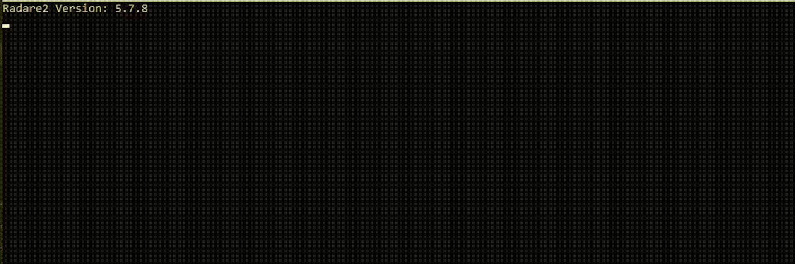

<h1 align="center">
  <picture>
    
  </picture>
</h1>

<div align="center">


</div>

<h3 align="center">
  Ntoskrnl.exe Offsets Dumper
</h3>

<div align="center">
  <picture>
    
  </picture>
</div>

### 📕 Prerequisites

- [Radare2](https://github.com/radareorg/radare2) - Make sure the environment variable PATH is configured and the Radare2 version is >= 5.0.0

- [Rust](https://www.rust-lang.org/tools/install)

### 📖 Usage

In order to dump those important structs from the system, the script must extract its offsets from the known ntoskrnl.exe file, generally placed at [`C:/Windows/System32/ntoskrnl.exe`](https://github.com/vtorres/ntoskrnl-offsets-dumper/blob/main/src/constants.rs#L3)

This script going to download ntoskrnl PDB, fetches a couple of crucial offsets from it and outputs all the relevant information needed for building your user navigation system with the kernel using the Bring Your Own Vulnerable Driver (A.K.A BYOVD) method for many purposes, like token stealing, handle elevation, thread hijacking and more. In the present moment, the necessary structs we are interested in are the following:

```shell
_LIST_ENTRY ActiveProcessLinks
void * UniqueProcessId
_LIST_ENTRY ThreadListHead
_PS_PROTECTION Protection
_EX_FAST_REF Token
_HANDLE_TABLE* ObjectTable
_KTRAP_FRAME* TrapFrame
uint64_t Rip
_LIST_ENTRY ThreadListEntry
_CLIENT_ID Cid
EtwThreatIntProvRegHandle
_ETW_GUID_ENTRY* GuidEntry
_TRACE_ENABLE_INFO ProviderEnableInfo
_GUID Guid
```

### 🖥️ Development

```shell
cargo run
```
or

```shell
cargo build --release
```

### 🏴‍☠️ Credits

After reading Kernel Cactus' latest blog post on a boring Sunday, I decided I would go through a coding session to do it.

- [Kernel Cactus](https://spikysabra.gitbook.io/kernelcactus/)

- [Vitor Torres](https://github.com/vtorres/)